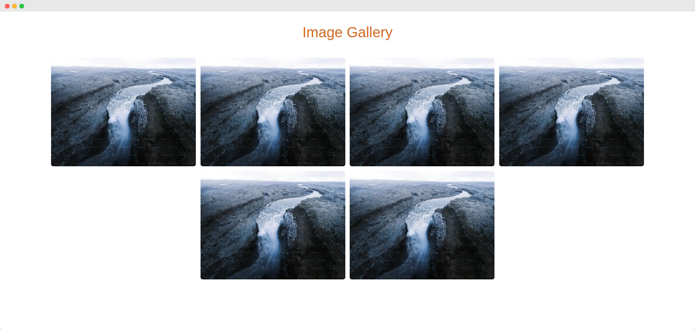

# Image Gallery - Learn CSS Flexbox

Building an image gallery using CSS flexbox

 

## Preview

### justify-content: flex-start

Comes by default

### justify-content: center

### justify-content: flex-end

### justify-content: space-around

### justify-content: space-between

### justify-content: space-evenly

 

## Reference

- [How to Create a Responsive Image Gallery With Flexbox - DeveloperDrive](https://www.developerdrive.com/responsive-image-gallery-flexbox/)
