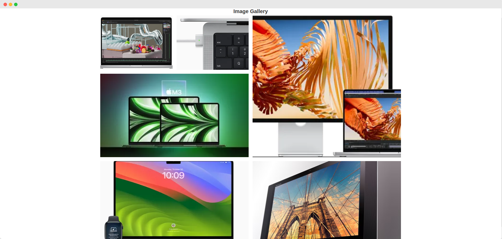
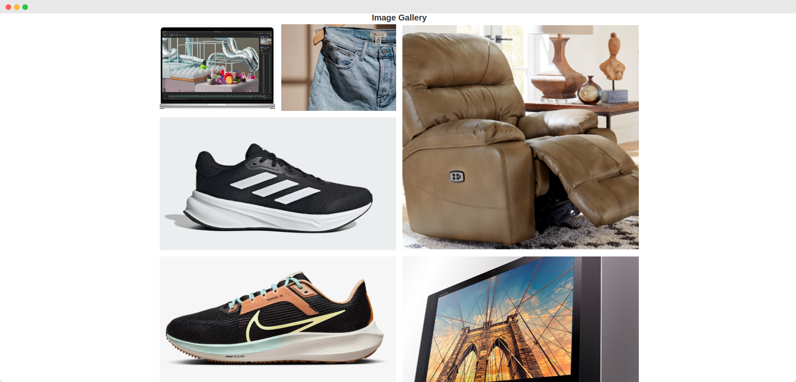

# Image Gallery - Learn CSS Grid

Building an image gallery using CSS grid

 

## Preview

 

## Reference

- [How to create an image gallery with CSS Grid - FreeCodeCamp](https://www.freecodecamp.org/news/how-to-create-an-image-gallery-with-css-grid-e0f0fd666a5c/)
